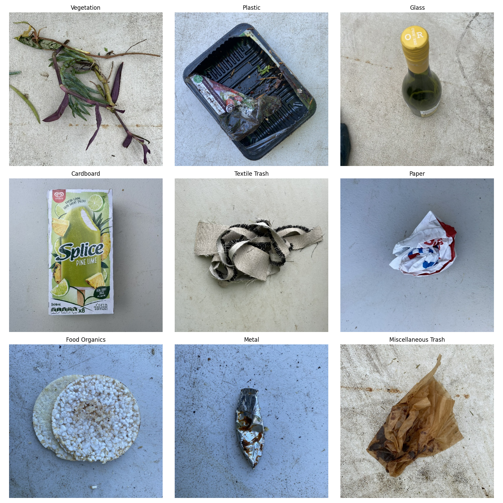

# ♻️ Clasificación Inteligente de Residuos Industriales (ML + DL)

Este proyecto desarrolla e implementa un sistema avanzado para la **clasificación automática de residuos industriales sólidos**. El objetivo es ofrecer una **solución de visión artificial robusta** capaz de trabajar en dos modos:

1.  **Clasificación en *Batch*:** A partir de un conjunto de imágenes estáticas.
2.  **Clasificación en Tiempo Real:** Utilizando la entrada de vídeo de una **cámara industrial o web** para la segregación instantánea de residuos.

La meta es optimizar los procesos industriales, reducir costes operativos y promover la sostenibilidad ambiental mediante la automatización inteligente.



--- 

## 🎯 Metodología y Enfoques

Para la resolución del problema y la comparación de resultados, se exploraron y compararon tres enfoques principales, analizando la interpretabilidad, el rendimiento y los requerimientos computacionales:

| Enfoque | Descripción | Modelo Principal |
| :--- | :--- | :--- |
| **A (ML Clásico)** | Extracción manual de características (color y textura) y entrenamiento con modelos tradicionales de Machine Learning. | SVM, Random Forest, etc. |
| **B (Deep Learning)** | Desarrollo de un clasificador mediante el uso de una Red Neuronal Convolucional (CNN) preentrenada y *Fine-Tuning*. | CNN (DL) |
| **C (Híbrido - Ganador)** | Uso de la CNN preentrenada como **Feature Extractor** para generar vectores de características, seguidos del entrenamiento con modelos clásicos de ML. | CNN (Extractor) + SVM (Clasificador) |

---

## 📊 Resultados Destacados

El **Enfoque C (Híbrido)** resultó ser la solución óptima para un entorno de producción que requiere baja latencia:

* **Predicciones Rápidas:** El modelo final (CNN + **SVM**) permite obtener **predicciones rápidas**, un factor clave para la clasificación en tiempo real con vídeo.
* **Bajo Coste Computacional:** El entrenamiento y la inferencia con el modelo SVM son rápidos y no presentan un coste computacional elevado.
* **Alta Precisión:** Se obtuvieron altos índices de precisión en la clasificación, superando la complejidad de los residuos industriales.
* **Optimización Industrial:** La solución es directamente aplicable para el **aumento de la productividad** y la mejora en la tasa de reciclaje.

---

## 🧪 Tecnologías

El proyecto fue desarrollado en Python, utilizando las siguientes herramientas principales:

* **Lenguaje:** Python 3.x
* **Deep Learning:** TensorFlow / Keras (para la CNN y el *Feature Extractor*)
* **Machine Learning:** scikit-learn (para el modelo SVM, el clasificador final)
* **Visión Artificial:** **OpenCV** (para el manejo de *frames* de la cámara en tiempo real y preprocesamiento de imágenes)
* **Entorno:** Jupyter Notebook

---

## 📁 Estructura del Repositorio


---

## 🚀 Mejoras Futuras

Las principales líneas de trabajo para la escalabilidad e industrialización del proyecto son:

1.  **Escalabilidad Industrial (Nuevas Clases):** Adaptar la aplicación para la clasificación de nuevas categorías de residuos de alto valor (ej. **chips electrónicos** o RAEE).
2.  **Ampliación del Dataset:** Aumentar la variabilidad y la cantidad de datos para mejorar la generalización, especialmente en el entrenamiento de los modelos Deep Learning.
3.  **Optimización del *Feature Extractor*:** Refinar la extracción de características para potenciar aún más las métricas obtenidas con los modelos clásicos de ML.
4.  **Integración de *Edge AI***: Implementar el modelo en hardware dedicado (*edge devices*) para una **reducción de latencia** crítica en entornos industriales.

---

## 🛠️ Cómo Ejecutar el Proyecto

1.  **Clonar el repositorio:**
    ```bash
    git clone [URL_DEL_REPOSITORIO]
    cd AI-based-Waste-Classifier
    ```

2.  **Instalar dependencias:**
    ```bash
    pip install -r requirements.txt 
    # Asegúrate de incluir tensorflow, keras, scikit-learn y opencv-python.
    ```

3.  **Ejecutar el Notebook:**
    * Abre el archivo `X.ipynb` en tu entorno (Jupyter/Colab).
    * Sigue las instrucciones dentro del notebook. Las celdas finales contendrán las funciones para:
        * **Clasificación Estática:** Proporcionar la ruta de una imagen.
        * **Clasificación en Tiempo Real:** Inicializar la captura desde la cámara (requiere que la cámara esté disponible y que la librería OpenCV funcione correctamente).
